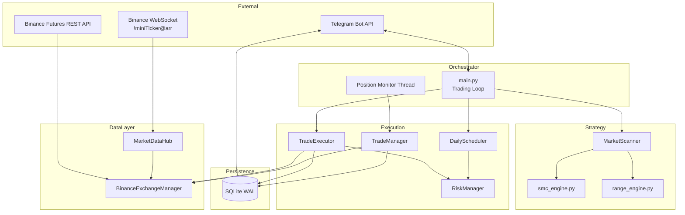

# Binance Futures Trading Bot — System Architecture & Technical Flow

> **Version:** Production architecture as implemented in this repository  
> **Market:** Binance USDT-M Perpetual Futures (Hedge Mode)  
> **Runtime:** 24/7 Python process with background threads

---

## Table of Contents

1. [System Architecture Overview](#1-system-architecture-overview)
2. [Real-Time Data Pipeline (WebSocket Hub)](#2-real-time-data-pipeline-websocket-hub)
3. [Dual Strategy Logic](#3-dual-strategy-logic)
4. [Trade Execution Lifecycle](#4-trade-execution-lifecycle)
5. [Trade Management & Exits](#5-trade-management--exits)
6. [Risk Management & Telegram Integration](#6-risk-management--telegram-integration)
7. [Module Reference](#7-module-reference)
8. [Configuration Summary](#8-configuration-summary)

---

## 1. System Architecture Overview

### 1.1 High-Level Design

The bot is a **multi-threaded, event-driven trading system** organized into five cooperating layers:

| Layer | Module(s) | Responsibility |
|-------|-----------|----------------|
| **Orchestrator** | `main.py`, `bot_controller.py` | Main loop, scan cycle, auto-restart, graceful shutdown |
| **Market Data Hub** | `market_data_hub.py`, `exchange.py` | WebSocket price streams, REST candle cache, rate-limit protection |
| **Strategy Engine** | `scanner.py`, `smc_engine.py`, `range_engine.py` | Universe filtering, SMC + Range signal generation |
| **Risk Engine** | `risk_manager.py`, `scheduler.py` | Pre-trade gates, daily PnL circuit breakers, drawdown limits |
| **Order & Trade Manager** | `executor.py`, `manager.py` | Order placement, virtual SL/TP, partial exits, reconciliation |
| **Integration Layer** | `telegram_bot.py`, `critical_alerts.py`, `database.py` | Alerts, commands, SQLite persistence |



### 1.2 Process Model

```
┌─────────────────────────────────────────────────────────────┐
│  Main Thread (main.py)                                      │
│  ┌─────────────────────────────────────────────────────┐   │
│  │  Every SCAN_INTERVAL_SECONDS (default 15s):         │   │
│  │    1. Reconciliation + DB maintenance               │   │
│  │    2. SMC scan → execute candidates                 │   │
│  │    3. RANGE scan → execute candidates (if enabled)  │   │
│  │    4. Heartbeat logging                             │   │
│  └─────────────────────────────────────────────────────┘   │
└─────────────────────────────────────────────────────────────┘

┌─────────────────────────────────────────────────────────────┐
│  Background Thread: Position Monitor (daemon)             │
│  Every MONITOR_INTERVAL_SECONDS (default 7s):               │
│    → TradeManager.monitor_open_trades()                     │
│    → ALWAYS runs, even when entries are paused              │
└─────────────────────────────────────────────────────────────┘

┌─────────────────────────────────────────────────────────────┐
│  Background Thread: Telegram Polling (daemon)               │
│    → Command handlers (/status, /stop, /pause, …)            │
└─────────────────────────────────────────────────────────────┘

┌─────────────────────────────────────────────────────────────┐
│  WebSocket Thread (python-binance ThreadedWebsocketManager)  │
│    → Continuous !miniTicker@arr stream → in-memory cache   │
└─────────────────────────────────────────────────────────────┘
```

**Key design principle:** *Pause blocks new entries only.* Open-position monitoring, SL/TP management, and reconciliation **always continue**.

### 1.3 Tech Stack

| Component | Technology |
|-----------|------------|
| Language | Python 3.11+ |
| Exchange SDK | `python-binance` (`Client`, `ThreadedWebsocketManager`) |
| WebSocket | Binance Futures multiplex stream (`!miniTicker@arr`) |
| Technical Analysis | `pandas`, `ta` (vectorized indicators) |
| Persistence | SQLite (WAL mode, thread-safe writes) |
| Configuration | `python-dotenv` (`.env`) |
| Notifications | `pyTelegramBotAPI` (Telegram long-polling) |
| Concurrency | `threading` (monitor, Telegram, WebSocket) |

> **Note:** This project uses `python-binance` directly rather than CCXT. The WebSocket hub and exchange adapter implement CCXT-equivalent patterns (`enableRateLimit`, caching, backoff) natively.

### 1.4 Strategy Priority

| Strategy Tag | Identifier | Max Slots | Priority |
|--------------|------------|-----------|----------|
| SMC Trend | `SMC_TREND` | 12 total (shared) | **1st** — scanned and executed first |
| Range Reversion | `RANGE_REVERSION` | 4 dedicated | **2nd** — fills remaining range slots |

---

## 2. Real-Time Data Pipeline (WebSocket Hub)

### 2.1 Architecture (`market_data_hub.py`)

The **MarketDataHub** is the central in-memory cache that decouples strategy logic from REST API calls.

```
┌──────────────────┐     WebSocket        ┌─────────────────────────┐
│ Binance Futures  │ ──────────────────►  │  _tickers{}             │
│ !miniTicker@arr  │   (all USDT pairs)   │  symbol → lastPrice,    │
└──────────────────┘                      │  quoteVolume, updated_at │
                                          └───────────┬─────────────┘
                                                      │
                                          ┌───────────▼─────────────┐
                                          │  Scanner / Manager      │
                                          │  reads cached prices    │
                                          └─────────────────────────┘

┌──────────────────┐     REST (cached)     ┌─────────────────────────┐
│ futures_klines   │ ──► bar-aligned ──►  │  _candles{}             │
│ (on new bar only)│                      │  (symbol, tf, limit) →  │
└──────────────────┘                      │  DataFrame + bar_open_ms│
                                          └─────────────────────────┘
```

#### Cache Types

| Cache | Key | Refresh Policy | Consumer |
|-------|-----|----------------|----------|
| **Ticker** | `symbol` | WebSocket push (real-time) | Universe filter, live price |
| **Candles** | `(symbol, timeframe, limit)` | Once per bar open (5m/15m/1h) | SMC/Range analysis |
| **Book Ticker** | all symbols | REST bulk, TTL 90s default | Spread filter |

#### WebSocket Stream

- Stream: `!miniTicker@arr` (all futures mini tickers in one multiplex connection)
- Fields cached: `lastPrice`, `quoteVolume`, `highPrice`, `lowPrice`, `openPrice`
- Staleness threshold: `WS_STALE_SECONDS` (default 120s) → falls back to REST

### 2.2 REST Rate-Limit Mitigation (`exchange.py`)

Multiple layers prevent Binance error **`-1003` (IP ban / rate limit)**:

```
Request Flow:
  Caller → RateLimiter.wait() → API call
                ↓ (on -1003)
           IMMEDIATE halt — no retry hammering
                ↓
           MarketDataHub.halt_scanning(300s)
                ↓
           Scanner skips cycles; monitor continues
```

| Mechanism | Config Key | Default | Description |
|-----------|------------|---------|-------------|
| Inter-request throttle | `MIN_REQUEST_INTERVAL_MS` | 150ms | Minimum gap between REST calls |
| Init pacing | `INIT_REST_DELAY_SECONDS` | 0.5s | Sleep between startup REST steps |
| Exponential backoff | `API_BACKOFF_MAX_SECONDS` | 60s | Retries on 429/-1015 (not -1003) |
| Scan halt on ban | `RATE_LIMIT_HALT_SECONDS` | 300s | Pauses scanning for 5 minutes |
| Bar-aligned candles | — | per TF | 1h candle fetched once/hour max |
| Book ticker TTL | `BOOK_TICKER_CACHE_SECONDS` | 90s | Single bulk REST refresh |
| Startup ban check | — | — | `futures_ping()` before init; defers REST if banned |

#### Startup Ban Recovery

```
Bot Start
   │
   ├─► futures_ping()
   │      ├─ OK → full exchange init (hedge mode, symbol rules)
   │      └─ BANNED → log ban duration, Telegram alert, defer init
   │
   ├─► MarketDataHub.start() → WebSocket stream
   │
   └─► Main loop: exchange.ensure_initialized() when halt clears
```

On `-1003` during runtime:
1. `handle_rate_limit_error()` parses `"banned until <ms>"` if present
2. Sets halt duration to `max(RATE_LIMIT_HALT_SECONDS, ban_remaining_seconds)`
3. Telegram critical alert sent
4. Scanner returns empty candidate lists until halt expires

---

## 3. Dual Strategy Logic

### 3.1 SMC Strategy (`SMC_TREND`)

**Purpose:** Trend-following Smart Money Concepts setups with multi-timeframe confluence.

**Timeframes analyzed per symbol:**

| Role | Default TF | Usage |
|------|------------|-------|
| Entry | 5m | Structure, OB/FVG, retest, scoring |
| Confirm | 15m | Trend alignment |
| Macro/Trend | 1h | Premium/Discount, macro trend |

#### Market Structure Detection (`scanner.py` → `MarketAnalyzer`)

Vectorized indicators computed on each timeframe:

- **EMAs:** 20, 50, 200 → trend classification (`trend_bullish`, `trend_bearish`)
- **Swing points:** 5-bar swing high/low detection
- **BOS / CHoCH:** Break of Structure vs Change of Character (trend-context aware)
- **Order Blocks:** Candle before displacement on BOS/CHoCH
- **FVG:** Fair Value Gaps (min gap = 15% ATR)
- **Liquidity Sweeps:** Wick beyond swing level + close back inside
- **ATR, ADX, RSI, MACD, Volume spike**

#### SMC Confluence Gate (`smc_engine.evaluate_confluence_gate`)

Hard gate — all conditions must pass:

```
┌─────────────────────────────────────────────────────────┐
│  1. MTF Alignment                                       │
│     macro (1h) + confirm (15m) aligned with action      │
│     OR neutral macro with entry-TF structure (optional) │
├─────────────────────────────────────────────────────────┤
│  2. Premium / Discount Zone                             │
│     LONG  → DISCOUNT (or equilibrium tolerance)         │
│     SHORT → PREMIUM  (or equilibrium tolerance)         │
├─────────────────────────────────────────────────────────┤
│  3. Confluence Retest (at least one)                    │
│     • SWEEP_RETEST  — price at swept liquidity level   │
│     • FVG_RETEST    — price in fair value gap zone      │
│     • OB_RETEST     — price in order block zone         │
└─────────────────────────────────────────────────────────┘
```

#### Retest Validation (`validate_retest_entry`)

- Price must be inside retest zone (ATR tolerance: `RETEST_ZONE_ATR_TOLERANCE`)
- Chase distance capped: `MAX_CHASE_ATR` from ideal zone midpoint

#### Scoring (`score_setup`)

Soft score (0–100+) — minimum threshold: `STRATEGY_MIN_SCORE` (default 70):

| Factor | Points |
|--------|--------|
| Base setup | ~60 |
| BOS signal | +bonus |
| CHoCH signal | +bonus (separate from BOS) |
| Volume spike | +`VOLUME_BONUS_POINTS` |
| Macro alignment | +bonus |
| Neutral macro setups | require `NEUTRAL_MACRO_MIN_SCORE` (75) |

#### SMC Stop Loss & Take Profit

- **SL:** Structural — below swept liquidity (LONG) / above swept liquidity (SHORT) with ATR buffer
- **TP ladder:** R-multiples from SL distance (1R / 2R / 3.5R default)
- **Opposing liquidity R:R gate:** `MIN_OPPOSING_RR` check before execution

---

### 3.2 Range Strategy (`RANGE_REVERSION`)

**Purpose:** Mean-reversion at range boundaries when the market is **not trending**.

#### Regime Detection (`range_engine.detect_range_regime`)

```
Range Regime ACTIVE when:
  ✓ 1h ADX ≤ RANGE_REGIME_MAX_ADX_1H (default 22)
  ✓ Valid range boundaries computed (48-bar lookback on 1h)
  ✓ Range size > 0
```

#### Range Boundaries

```
range_high = max(high) over RANGE_LOOKBACK_BARS (1h)
range_low  = min(low)  over RANGE_LOOKBACK_BARS (1h)
equilibrium = (range_high + range_low) / 2
```

#### Entry Triggers (`evaluate_range_setup`)

| Direction | Entry Condition | RSI Bonus | Confirm Trend |
|-----------|----------------|-----------|---------------|
| **LONG** | Price ≤ `range_low + edge_tol` | RSI ≤ 42 | LONG or NEUTRAL |
| **SHORT** | Price ≥ `range_high - edge_tol` | RSI ≥ 58 | SHORT or NEUTRAL |

- Edge tolerance: `RANGE_EDGE_ATR_TOLERANCE × ATR`
- Minimum score: `RANGE_MIN_SCORE` (default 65)
- Room to equilibrium must exceed `MIN_OPPOSING_RR × 0.5 × ATR`

#### Range SL / TP (`compute_range_sl_tp`)

| | LONG | SHORT |
|---|------|-------|
| **SL** | Below entry: `min(range_low - buffer, entry - buffer)` | Above entry: `max(range_high + buffer, entry + buffer)` |
| **TP1** | Equilibrium (min 1R) | Equilibrium (min 1R) |
| **TP2** | Midpoint eq→high | Midpoint eq→low |
| **TP3** | Near range high | Near range low |

**Directional SL enforcement:**
- LONG: `SL < Entry` (always)
- SHORT: `SL > Entry` (always)
- Validated pre-order in `TradeExecutor._validate_stop_loss()`

#### Range Position Sizing

- Uses `RANGE_SIZE_MULTIPLIER` (default **0.5×**) of normal risk-based size
- Max **4** concurrent RANGE positions (`MAX_RANGE_POSITIONS`)
- Separate kill-switch: daily range loss % and consecutive range losses

---

### 3.3 Scanner Flow (Both Strategies)

```
get_tradable_symbols()
  │  Bulk: get_futures_ticker_map() [WS cache]
  │  Bulk: get_book_ticker_map()    [TTL cache]
  │  Filter: volume, spread, blacklist
  │  Sort by 24h quote volume → top MAX_SCAN_UNIVERSE (60)
  │
  ▼
For each symbol (sequential, SCAN_PAIR_DELAY_SECONDS between):
  │
  ├─ fetch entry / confirm / trend candles [bar-aligned cache]
  ├─ apply_all_indicators()
  ├─ evaluate LONG and SHORT independently
  ├─ pick higher score (skip if |long - short| < threshold)
  └─ log signal + rejection to DB
  │
  ▼
Sort candidates by score → return top N
  SMC  → top MAX_POSITIONS (12)
  RANGE → top MAX_RANGE_POSITIONS (4)
```

**Scan halt:** If `MarketDataHub.is_scan_halted()` → return empty list (no REST hammering).

---

## 4. Trade Execution Lifecycle

### 4.1 End-to-End Flow

```mermaid
sequenceDiagram
    participant Loop as Main Loop
    participant Scan as MarketScanner
    participant Risk as RiskManager
    participant Sched as DailyScheduler
    participant Exec as TradeExecutor
    participant Exch as Exchange
    participant DB as Database
    participant TG as Telegram

    Loop->>Scan: scan_market() [SMC]
    Scan-->>Loop: candidates[]
    Loop->>Scan: scan_range_market() [RANGE]
    Scan-->>Loop: range_candidates[]

    loop Each candidate (max MAX_ENTRIES_PER_CYCLE)
        Loop->>Loop: _validate_candidate()
        Loop->>Sched: is_entry_paused()?
        Loop->>Risk: can_open_trade(symbol, strategy)?
        Loop->>Exec: execute_trade()
        Exec->>Exec: calculate SL/TP
        Exec->>Exec: _validate_stop_loss()
        Exec->>Exec: calculate_position_size()
        Exec->>Exch: execute_futures_order(MARKET)
        Exch-->>Exec: fill response
        Exec->>Exec: recalculate SL/TP at fill price
        Exec->>Exec: _validate_stop_loss() [post-fill]
        Exec->>DB: log_trade()
        Exec-->>Loop: result
        Loop->>TG: send_trade_alert()
    end
```

### 4.2 Pre-Execution Gates (All Must Pass)

| Gate | Module | Check |
|------|--------|-------|
| Candidate validation | `main.py` | symbol, action, ATR, price, min score |
| Manual pause | `scheduler.py` | `/pause` or controller flag |
| Daily PnL limit | `scheduler.py` | Target (+20%) or stop (-10%) hit |
| Max positions | `risk_manager.py` | Exchange open ≤ 12 |
| Max daily entries | `risk_manager.py` | Entries ≤ 40/day |
| Consecutive losses | `risk_manager.py` | Streak < 5 (resets on `/resume`) |
| Drawdown | `risk_manager.py` | Realized drawdown < 20% |
| Range kill-switch | `database.py` | Range daily loss / consecutive losses |
| Symbol cooldown | `database.py` | Post-close cooldown (20 min SMC / 5 min RANGE) |
| Duplicate position | `exchange.py` | No existing hedge-side position |
| Scan halt | `market_data_hub.py` | Not IP-banned / rate-limited |
| SL direction sanity | `executor.py` | LONG: SL < entry; SHORT: SL > entry |
| Opposing R:R (SMC only) | `smc_engine.py` | Room to liquidity ≥ 1.5R |

### 4.3 Order Calculation

#### Position Sizing (`executor.calculate_position_size`)

```
risk_amount = balance × (RISK_PER_TRADE_PERCENT / 100) × size_multiplier
sl_distance = |entry - SL|
quantity    = risk_amount / sl_distance

size_multiplier:
  SMC:   1.0 (score ≥ 80) or 0.5 (score ≥ 70)
  RANGE: 0.5 (RANGE_SIZE_MULTIPLIER)

Constraints:
  • quantity ≥ min_qty (exchange rules)
  • notional ≥ min_notional
  • notional ≤ balance × MAX_POSITION_VALUE_MULTIPLIER (1.5×)
```

#### Stop Loss Validation

```python
# Enforced in TradeExecutor._validate_stop_loss()
LONG:  SL < Entry   # stop below entry
SHORT: SL > Entry   # stop above entry

# Invalid → abort order, log rejection, no exchange call
# Post-fill invalid → close orphan position immediately
```

#### Take Profit Structure

Partial exit partition (fixed ratios):

| Level | Portion | Status After |
|-------|---------|--------------|
| TP1 | 33% | `TP1_HIT` → SL moves to break-even |
| TP2 | 33% | `TP2_HIT` → SL moves to TP1 |
| TP3 | 34% | `CLOSED` (full exit) |

### 4.4 Exchange Order Execution

- **Mode:** Binance Futures Hedge Mode (dual-side positions)
- **Order type:** MARKET entry
- **Leverage:** Auto-set per symbol (`optimize_and_set_leverage`)
- **Fill price:** Resolved from order response → WS cache fallback
- **Persistence:** Full trade record + metadata JSON to SQLite

---

## 5. Trade Management & Exits

### 5.1 Monitor Loop (`manager.py`)

Runs every **7 seconds** in a background daemon thread — **independent of entry pause state**.

```
monitor_open_trades()
  │
  For each open trade in DB:
  │
  ├─ Reconcile: exchange qty = 0? → mark RECONCILED_EXTERNAL_CLOSE
  │
  ├─ [RANGE only] _check_range_hard_exits()
  │     ├─ Time stop (16 bars)
  │     ├─ Boundary breakout (bar close, grace period)
  │     └─ ADX breakout (15m ADX ≥ 25)
  │
  └─ _manage_long_trade() / _manage_short_trade()
        ├─ Stop loss hit
        ├─ Trailing stop (ATR-based, after TP1)
        ├─ TP1 → partial close 33%
        ├─ TP2 → partial close 33%
        └─ TP3 → close remaining 34%
```

### 5.2 Exit Triggers

| Exit Reason | Applies To | Trigger |
|-------------|------------|---------|
| `STOP_LOSS` | All | Live price crosses SL (virtual, not exchange order) |
| `TP1` / `TP2` / `TP3` | All | Price reaches TP level → partial/full close |
| `TP3_FULL_CLOSE` | All | Final 34% closed at TP3 |
| `RANGE_BOUNDARY_BREAKOUT` | RANGE | Closed bar closes beyond boundary (see §5.3) |
| `RANGE_ADX_BREAKOUT` | RANGE | 15m ADX ≥ 25 (trend emerging) |
| `RANGE_TIME_STOP` | RANGE | ≥ 16 entry-TF bars elapsed |
| `MANUAL_CLOSE_ALL` | All | `/closeall` Telegram command |
| `RECONCILED_EXTERNAL_CLOSE` | All | Position closed externally on exchange |

### 5.3 Range Boundary Breakout — Grace Period Logic

**Problem solved:** Immediate false exit when entering at range edge on the entry candle.

**Implementation (`_check_range_boundary_breakout`):**

```
Conditions ALL required:
  1. bars_elapsed ≥ 1   (at least one full entry-TF bar AFTER entry)
  2. Use LAST CLOSED bar close price (not live tick / wicks)
  3. Direction-specific breakout:
       LONG  → close < range_low  - (ATR × RANGE_BREAKOUT_ATR_MULT)
       SHORT → close > range_high + (ATR × RANGE_BREAKOUT_ATR_MULT)
```

```
Timeline (5m entry TF example):

  Bar 0 (entry bar)   │── entry at range high ──│  ← NO boundary check
  Bar 1 (first close) │── evaluate close price ──│  ← boundary check starts
  Bar 2+              │── continue monitoring ───│
```

Bar elapsed calculation: `(now - opened_at) // entry_bar_seconds`

### 5.4 Dynamic Stop Management (SMC & Range)

| Event | SL Action |
|-------|-----------|
| TP1 hit | Move SL to **break-even** (entry price) |
| TP2 hit | Move SL to **TP1 price** |
| Trailing active | SL trails at `best_price ± 1× ATR` (after price passes entry) |

### 5.5 Position Close Mechanics

- Closes via **market reduce** on exchange (`close_position_quantity`)
- Updates DB: status, PnL, exit_reason, duration, metadata flags
- Applies symbol cooldown (SMC: 20 min, RANGE: 5 min)
- Notifies Telegram + updates risk counters

---

## 6. Risk Management & Telegram Integration

### 6.1 Risk Engine (`risk_manager.py`)

#### Portfolio Limits

| Parameter | Default | Effect |
|-----------|---------|--------|
| `MAX_OPEN_POSITIONS` | 12 | Hard cap on exchange positions |
| `MAX_RANGE_POSITIONS` | 4 | Sub-cap for range strategy |
| `MAX_DAILY_TRADES` | 40 | Max new entries per UTC day |
| `MAX_CONSECUTIVE_LOSSES` | 5 | Blocks entries until `/resume` |
| `MAX_ACCOUNT_DRAWDOWN` | 20% | Realized PnL drawdown from peak |
| `DAILY_TARGET_PERCENT` | +20% | Pause entries when hit (realized) |
| `DAILY_STOP_PERCENT` | -10% | Pause entries when hit (realized) |
| `RISK_PER_TRADE_PERCENT` | 2% | Per-trade risk budget |

#### Daily Scheduler (`scheduler.py`)

- UTC day rollover → reset daily stats, refresh start balance
- Uses **realized PnL only** for circuit breakers (unrealized excluded)
- Manual pause/resume via Telegram or `BotController`

#### Range Kill-Switch (`database.is_range_entries_paused`)

Pauses **range entries only** when:
- Range strategy daily realized loss ≥ `RANGE_DAILY_MAX_LOSS_PERCENT` (3%)
- Range consecutive losses ≥ `RANGE_MAX_CONSECUTIVE_LOSSES` (2)

### 6.2 Telegram Bot (`telegram_bot.py`)

Long-polling daemon thread. All commands require authorized `TELEGRAM_CHAT_ID`.

#### Commands

| Command | Description |
|---------|-------------|
| `/ping` | Bot health check (online / testnet/mainnet) |
| `/status` | Daily PnL, win rate, profit factor, entry count |
| `/risk` | Full risk snapshot — positions, drawdown, blocks |
| `/positions` | List open trades with strategy label |
| `/market` | BTC macro trend & volatility snapshot |
| `/balance` | Live futures USDT balance |
| `/pause` | Pause new entries (monitoring continues) |
| `/resume` | Resume entries + reset consecutive loss counter |
| `/closeall` | Emergency close all open positions |
| `/stop` | Graceful bot shutdown |
| `/restart` | Graceful restart (preserves state) |
| `/errors` | Recent critical errors from DB |
| `/help` | Command reference |

> **Note:** There is no `/start` command — the bot auto-starts via `python main.py` / `run_with_auto_restart()`. Use `/ping` for liveness.

#### Alert Types

| Alert | Trigger |
|-------|---------|
| Trade entry | Successful execution with SL/TP levels |
| TP level hit | Partial close with new SL |
| Trade close | Final PnL and exit reason |
| Daily target/stop | Scheduler circuit breaker |
| IP ban / rate limit | `-1003` detection at startup or runtime |
| Critical errors | Order failures, orphan fills, API disconnect |
| Bot lifecycle | Start, stop, restart notifications |

### 6.3 Critical Alert Service (`critical_alerts.py`)

- Categories: `RATE_LIMIT`, `API_DISCONNECT`, `ORDER_FAILURE`, `ORPHAN_FILL`, `DATABASE`, `UNHANDLED_EXCEPTION`
- Deduplication cooldown: `CRITICAL_ALERT_COOLDOWN_SECONDS` (300s)
- Persisted to SQLite for `/errors` command

### 6.4 Auto-Restart (`main.run_with_auto_restart`)

- Graceful restart via `/restart` Telegram command
- Crash recovery with exponential backoff (`RESTART_DELAY_SECONDS` → `MAX_RESTART_DELAY_SECONDS`)
- `MAX_AUTO_RESTARTS` (0 = unlimited)
- WebSocket hub stopped cleanly on shutdown

---

## 7. Module Reference

```
binance-futures-bot/
├── main.py                 # Entry point, orchestration loop
├── market_data_hub.py      # WebSocket + candle/ticker cache
├── exchange.py             # Binance REST adapter, rate limiting
├── scanner.py              # Universe filter, SMC + Range scanning
├── smc_engine.py           # SMC gates, scoring, structural SL/TP
├── range_engine.py         # Range regime, mean-reversion, range SL/TP
├── executor.py             # Order placement, sizing, SL validation
├── manager.py              # Virtual SL/TP, partial exits, range kills
├── risk_manager.py         # Portfolio risk gates
├── scheduler.py            # Daily PnL circuit breakers
├── database.py             # SQLite persistence (trades, signals, stats)
├── telegram_bot.py       # Telegram commands & alerts
├── critical_alerts.py      # Critical error notification service
├── bot_controller.py       # Shutdown/restart/pause flags (thread-safe)
├── reconciliation.py       # DB ↔ exchange position sync
├── reporter.py             # Daily/weekly CSV exports
├── config.py               # Environment-driven configuration
├── constants.py            # Strategy tags, trade statuses, ratios
├── logger.py               # Structured logging (system/trade/error)
├── utils.py                # Safe float, rounding, UTC helpers
└── exceptions.py           # ExchangeError, ExchangeRateLimitError, etc.
```

---

## 8. Configuration Summary

Key environment variables (see `.env.example` for full list):

```env
# Network / Rate Limiting
ENABLE_WEBSOCKET_STREAMS=True
MIN_REQUEST_INTERVAL_MS=150
INIT_REST_DELAY_SECONDS=0.5
RATE_LIMIT_HALT_SECONDS=300
WS_STALE_SECONDS=120

# Portfolio
MAX_OPEN_POSITIONS=12
MAX_RANGE_POSITIONS=4
RISK_PER_TRADE_PERCENT=2.0
DAILY_TARGET_PERCENT=20.0
DAILY_STOP_PERCENT=10.0

# SMC
STRATEGY_MIN_SCORE=70.0
ENTRY_TIMEFRAME=5m
CONFIRM_TIMEFRAME=15m
TREND_TIMEFRAME=1h

# Range
ENABLE_RANGE_REGIME=True
RANGE_REGIME_MAX_ADX_1H=22.0
RANGE_MIN_SCORE=65.0
RANGE_TIME_STOP_BARS=16
RANGE_BREAKOUT_ATR_MULT=0.3

# Loop Timing
SCAN_INTERVAL_SECONDS=15
MONITOR_INTERVAL_SECONDS=7
SCAN_PAIR_DELAY_SECONDS=0.25
```

---

## Appendix: Quick Reference Diagrams

### Data Flow (Single Scan Cycle)

```
  WS Ticker Cache ──────► Universe Filter ──► [60 symbols]
                                                 │
  Cached Klines (5m/15m/1h) ◄── REST (bar-aligned)
                                                 │
                                    ┌────────────┴────────────┐
                                    ▼                         ▼
                              SMC Evaluation            Range Evaluation
                                    │                         │
                                    └────────────┬────────────┘
                                                 ▼
                                          Risk Gates
                                                 ▼
                                          Execute Trade
                                                 ▼
                                    DB + Telegram Alert
```

### Trade State Machine

```
                    ┌──────────┐
         entry ───► │   OPEN   │
                    └────┬─────┘
                         │ TP1 hit (33% closed, SL → BE)
                    ┌────▼─────┐
                    │ TP1_HIT  │
                    └────┬─────┘
                         │ TP2 hit (33% closed, SL → TP1)
                    ┌────▼─────┐
                    │ TP2_HIT  │
                    └────┬─────┘
                         │ TP3 hit (34% closed)
                    ┌────▼─────┐
                    │  CLOSED  │
                    └──────────┘

  Any state ──► CLOSED via: STOP_LOSS | RANGE_* | MANUAL | RECONCILED
```

---

*Document generated from the production codebase. For operational setup, see `.env.example` and project README.*
