# Binance Futures Trading Bot — System Architecture

> **Version:** Event-driven WS-first pipeline as implemented in this repository  
> **Market:** Binance USDT-M Perpetual Futures (Hedge Mode)  
> **Runtime:** 24/7 Python 3.11+ process with background threads

---

## Table of Contents

1. [System Architecture Overview](#1-system-architecture-overview)
2. [Real-Time Data Pipeline (WebSocket Hub)](#2-real-time-data-pipeline-websocket-hub)
3. [Opportunity Ranking & Event-Driven Scan](#3-opportunity-ranking--event-driven-scan)
4. [Strategy Registry](#4-strategy-registry)
5. [Trade Execution Lifecycle](#5-trade-execution-lifecycle)
6. [Trade Management & Exits](#6-trade-management--exits)
7. [Risk Management & Telegram](#7-risk-management--telegram)
8. [Module Reference](#8-module-reference)
9. [Configuration Summary](#9-configuration-summary)

---

## 1. System Architecture Overview

### 1.1 High-Level Design

The bot is a **WebSocket-first, event-driven trading system**. Ranking and strategy evaluation read local caches. REST is reserved for startup, execution, and recovery.

| Layer | Module(s) | Responsibility |
|-------|-----------|----------------|
| **Orchestrator** | `main.py`, `bot_controller.py` | Main loop, scan dispatch, auto-restart, graceful shutdown |
| **Market Data Hub** | `market_data_hub.py`, `exchange.py` | `!miniTicker@arr`, kline cache, REST lanes, rate-limit halt |
| **Universe & Ranker** | `pipeline/universe_builder.py`, `core/opportunity_tracker.py` | WS-only coin ranking, lifecycle, HOT vs rotating queues |
| **Scan Orchestrator** | `pipeline/event_scan_orchestrator.py`, `scanner.py` | Candle-close + HOT + background batches; `scanner.py` is a facade |
| **Strategy Engine** | `core/strategy_registry.py`, `strategies/*`, `engines/*` | 15 registered modules (+ legacy `SMC_MULTITF`) |
| **Risk Engine** | `core/risk_engine.py`, `core/portfolio_allocator.py`, `risk_manager.py`, `scheduler.py` | Pre-trade gates, strategy budgets, daily circuit breakers |
| **Order & Trade Manager** | `executor.py`, `manager.py` | Market entries, virtual SL/TP, partial exits, reconciliation |
| **Integration** | `telegram_bot.py`, `critical_alerts.py`, `database.py` | Alerts, commands, SQLite WAL |

Default runtime path (`ENABLE_EVENT_DRIVEN_SCAN=True`):

```
Binance WS → MarketDataHub → UniverseBuilder → OpportunityTracker
    → ScanPriorityQueue (HOT / rotating)
    → EventScanOrchestrator (scan_context: REST blocked)
    → ScoringEngine + StrategyRegistry
    → SymbolConflictGuard → PortfolioAllocator
    → RiskEngine → TradeExecutor → TradeManager
```



```mermaid
flowchart LR
    BINANCE_WS[Binance WS] --> HUB[MarketDataHub]
    HUB --> UNI[UniverseBuilder]
    UNI --> TRACK[OpportunityTracker]
    TRACK --> SCAN[EventScanOrchestrator]
    SCAN --> SCORE[ScoringEngine]
    SCORE --> ALLOC[PortfolioAllocator]
    ALLOC --> RISK[RiskEngine]
    RISK --> EXEC[TradeExecutor]
    EXEC --> MGR[TradeManager]
```

### 1.2 Process Model

```
┌─────────────────────────────────────────────────────────────┐
│  Main Thread (main.py)                                      │
│  Every SCAN_INTERVAL_SECONDS (default 15s):                 │
│    1. Reconciliation + DB maintenance                       │
│    2. process_priority_scan_cycle() (event-driven only)     │
│    3. RiskEngine + TradeExecutor (skipped when DRY_RUN)     │
│    4. Heartbeat logging                                     │
└─────────────────────────────────────────────────────────────┘

┌─────────────────────────────────────────────────────────────┐
│  TradeManager — single position monitor                     │
│    1s  → WS-only TP/SL evaluation                           │
│    MONITOR_INTERVAL_SECONDS (default 7s)                    │
│         → REST mark prefetch for stale symbols              │
│         → position cache refresh                            │
│    miniTicker ticks → coalesced price-tick worker           │
│    Pause does NOT stop this loop                            │
└─────────────────────────────────────────────────────────────┘

┌─────────────────────────────────────────────────────────────┐
│  Telegram polling + monitor watchdog (daemons)              │
└─────────────────────────────────────────────────────────────┘

┌─────────────────────────────────────────────────────────────┐
│  WebSocket (python-binance ThreadedWebsocketManager)        │
│    !miniTicker@arr + kline streams for the watchlist        │
└─────────────────────────────────────────────────────────────┘
```

**Key design principle:** *Pause blocks new entries only.* Open-position monitoring, SL/TP, and reconciliation always continue.

### 1.3 Tech Stack

| Component | Technology |
|-----------|------------|
| Language | Python 3.11+ |
| Exchange SDK | `python-binance` (`Client`, `ThreadedWebsocketManager`) |
| WebSocket | Binance USDT-M `!miniTicker@arr` + kline multiplex |
| Indicators | `pandas`, `ta` |
| Persistence | SQLite (WAL, parameterized SQL) |
| Configuration | `python-dotenv` (`.env`) |
| Notifications | `pyTelegramBotAPI` |
| Concurrency | `threading` (monitor, Telegram, WebSocket, close worker) |

Default `USE_TESTNET=True`. `DRY_RUN=False` on testnet so validated signals place live Testnet orders. Missing `DRY_RUN` on mainnet stays `True` (fail-closed).

### 1.4 Scan Path Flags

| Flag | Default | Effect |
|------|---------|--------|
| `ENABLE_EVENT_DRIVEN_SCAN` | `True` | Documented intent; main loop is always event-driven |
| `USE_UNIFIED_SCAN_PIPELINE` | `False` | Ignored by `main.py` (wrappers remain on `scanner.py` for tests) |
| `ENABLE_PORTFOLIO_ALLOCATOR` | `True` | Margin/slot budget on the event path |
| `DRY_RUN` | `False` on testnet | Hard stop in `executor.execute_trade` only when True |

Do not add a fourth scan loop. Ranking lives inside `UniverseBuilder` / `OpportunityTracker`.

---

## 2. Real-Time Data Pipeline (WebSocket Hub)

### 2.1 Architecture (`market_data_hub.py`)

`MarketDataHub` is the in-memory cache that decouples strategies from REST.

| Cache | Source | Consumers |
|-------|--------|-----------|
| Ticker map | `!miniTicker@arr` | Universe filter, opportunity score, live price |
| Kline cache | WS kline streams (+ REST bootstrap) | Strategy evaluation, ATR, extras |
| Book ticker | WS book ticker when available; else ticker proxy | Spread filter |
| User/position | User data stream + REST cache | Monitor, risk, reconciliation |

Scan, ranking, and sub-scans run under `exchange.scan_context()` which **blocks REST**. Execution uses `execution_context()` (priority REST lane).

#### Staleness & halt

- Ticker / bookTicker stale: `WS_STALE_SECONDS` (30s mainnet) / `WS_STALE_SECONDS_TESTNET` (180s). Watchdog force-resets `miniTicker`, `bookTicker`, and `userData` only when kline feeds are also stale (and not inside `WS_STALE_RECONNECT_COOLDOWN_SECONDS`). Quiet Testnet tickers with live klines are `DEGRADED` — REST ticker cache is refreshed, klines are not torn down. `/health` is `HEALTHY` after a live tick. Ping/pong: 15s / 10s. Execution uses REST `fetch_ticker()` when WS is STALE/WARMING/DEGRADED.
- `-1003` IP ban → `halt_scanning()`; scanner returns empty; monitor continues
- Startup `futures_ping()` defers REST init if already banned

### 2.2 REST Rate-Limit Mitigation (`exchange.py`)

| Mechanism | Config | Role |
|-----------|--------|------|
| Inter-request throttle | `MIN_REQUEST_INTERVAL_MS` | Minimum REST gap |
| Execution lane | `EXECUTION_MIN_REQUEST_INTERVAL_MS` | Faster gap for orders |
| Scan REST block | `scan_context()` | Ranking/eval never hit REST |
| Ban halt | `RATE_LIMIT_HALT_SECONDS` | Pause scanning on `-1003` |
| Book / position TTLs | `BOOK_TICKER_CACHE_SECONDS`, `POSITION_CACHE_TTL_SECONDS` | Bulk refresh, not per-symbol spam |

---

## 3. Opportunity Ranking & Event-Driven Scan

This is the **Dynamic Market Coin Scanner**. It is not a separate module.

### 3.1 UniverseBuilder (`pipeline/universe_builder.py`)

- Builds the tradable pool from the **WS ticker cache only** (no REST ticker map).
- Filters: USDT-M perpetual, volume, spread, 24h range, ATR, mega-cap list, DB blacklist.
- Ranks by 3-channel opportunity score (not raw volume).
- Primary pool: `TOP_UNIVERSE_POOL_SIZE`. Extended/rotating: `ROTATION_EXTENDED_POOL_SIZE`.

**Live ticker throttle (`observe_live_tickers`):**

Between universe rebuilds, only **primary + extended + non-dormant tracker records** are re-scored. The full USDT ticker map is not walked every cycle.

**Blacklist cache:** `get_active_blacklist_symbols()` is loaded at most every `BLACKLIST_CACHE_SECONDS` (default 60s). Per-symbol SQLite `is_blacklisted()` is not used on the hot path.

### 3.2 OpportunityTracker (`core/opportunity_tracker.py`)

WS-only ranking state. Inputs: ticker features + optional kline extras (range burst, wick, volume burst).

Binance `!miniTicker@arr` does **not** carry open interest. `_is_spike` therefore proxies an OI burst from price delta, 24h quote-volume ratio, 24h range expansion, and cached-bar volume burst. Real OI/funding stays on the cached derivatives path used by `OI_FUNDING`, not on ranking.

| Channel | Default weight | Role |
|---------|----------------|------|
| Momentum | 0.40 | Range expansion, change %, volume |
| Reversal | 0.30 | Wick rejection, mean-reversion hints |
| Structure | 0.30 | Compression, consistency |

Composite score is **0–100**. Tracker also stores velocity, relative rank, and peak score.

**Lifecycle:** `UNSEEN → DISCOVERED → CANDIDATE → WATCH → ACTIVE → HOT → OPPORTUNITY` with `WEAKENED` / `DORMANT` on decay (`OPPORTUNITY_SCORE_HALF_LIFE_MINUTES`, `OPPORTUNITY_STALE_SECONDS`).

### 3.3 Dual queue (`core/scan_priority_queue.py`, `core/symbol_rotation_manager.py`)

| Queue | Who | Cadence |
|-------|-----|---------|
| HOT / priority | High score, spikes, fast-track | `HOT_SCAN_INTERVAL_SECONDS` |
| Rotating background | Remainder of pool + extended | Batches of `ROTATING_SCAN_BATCH_SIZE` |

`EventScanOrchestrator` skips HOT symbols in the background batch, then `_dedupe_symbol_candidates` keeps one candidate per symbol (highest `adjusted_score`).

### 3.4 EventScanOrchestrator

Each cycle:

1. Gate: hub scan halt
2. Periodic Tier-1 refresh (`TIER1_REFRESH_INTERVAL_SECONDS`, default 30 min)
3. Fast-track live spikes from `observe_live_tickers()`
4. HOT scan → background batch → due candle-close events
5. Per symbol: snapshot from WS klines → `ScoringEngine` → conflict guard → **PortfolioAllocator** (if enabled) → persist signal

Live wrappers `scan_market` / `scan_unified` / `scan_range_market` were removed from `scanner.py`. The live loop uses `process_priority_scan_cycle()` only.

---

## 4. Strategy Registry

`strategies.build_strategy_registry()` registers the modules below. Each implements `BaseStrategy` and self-filters by enable flag, regime, and min score.

| Tag | Module | Role |
|-----|--------|------|
| `SMC_TREND` | `strategies/strategy_smc.py` + `engines/smc_engine.py` | Trend SMC (BOS/CHoCH, OB/FVG, structural SL) |
| `SMC_MULTITF` | legacy alias | Same SMC budget/slots |
| `RANGE_REVERSION` | `strategies/strategy_range.py` + `engines/range_engine.py` | Mean-reversion at 1h range edges |
| `LIQUIDITY_SWEEP_CONT` | `strategies/strategy_lsc.py` | Sweep + continuation |
| `VWAP_PULLBACK` | `strategies/strategy_vwap.py` | VWAP pullback |
| `VOLUME_PROFILE_BREAKOUT` | `strategies/strategy_vpb.py` | VP breakout |
| `VOL_EXPANSION_MR` | `strategies/strategy_vemr.py` | Expansion mean-reversion |
| `BREAKOUT_RETEST` | `strategies/breakout_retest.py` | Breakout retest |
| `FALSE_BREAKOUT_SFP` | `strategies/false_breakout_sfp.py` | Swing-failure / SFP |
| `VOL_SQUEEZE` | `strategies/volatility_squeeze.py` | Squeeze expansion |
| `TREND_MOMENTUM` | `strategies/trend_continuation.py` | Trend continuation |
| `PRICE_ACTION_REVERSAL` | `strategies/candle_reversals.py` | Candle reversals |
| `MTF_ALIGNMENT` | `strategies/mtf_alignment.py` | Multi-TF alignment context |
| `VP_KEYLEVEL` | `strategies/volume_profile.py` | Volume-profile key levels |
| `ORDER_FLOW` | `strategies/order_flow_imbalance.py` | Order-flow imbalance context |
| `OI_FUNDING` | `strategies/oi_funding_context.py` | OI / funding context (cached derivatives) |

`VWAP_MEAN_REVERSION` is **unregistered** (`strategies/strategy_extensions.py` is empty) so it cannot consume allocator slots until a real engine exists.

`RegimeRouter.classify()` labels `strong_trend` / `range_chop` / `compression` / `expansion_spike` / `unclear` from WS candles. `strategies_for_regime()` returns the strategy tags allowed for that regime (aligned with each module's `allowed_regimes()`). Strategies still self-filter as a second gate.

`PortfolioAllocator` maps every live tag (including context strategies) to `STRATEGY_BUDGET_*` and `MAX_*_POSITIONS`. Unknown tags fall back to `RISK_PER_TRADE_PERCENT` and `MAX_POSITIONS`.

---

## 5. Trade Execution Lifecycle

### 5.1 Dispatch (`main._execute_candidates`)

1. Validate candidate dict
2. Entry gate (`scheduler` + `risk_manager` + DB)
3. `RiskEngine.approve_entry`
4. `TradeExecutor.execute_trade`

If `DRY_RUN=True`, step 4 logs `[DRY_RUN]` and returns without `execution_context()` / orders.

### 5.2 Executor (`executor.py`)

- Structural SL (strategy metadata or ATR fallback)
- R-multiple TP ladder (defaults 1R / 2R / 3.5R; 30% / 30% / 40% size)
- Tiered sizing from score + allocator `size_multiplier` / `risk_budget_usdt` in metadata
- Hedge-mode MARKET entry, leverage set per symbol
- Native TP/SL when enabled; otherwise virtual (soft) monitor
- Persist trade + JSON metadata to SQLite

### 5.3 Mutexes

- `entry_in_flight_mutex` — one entry per symbol
- `trade_close_mutex` — one close per trade
- `symbol_blocked_for_new_entry` — DB open trade or exchange position

---

## 6. Trade Management & Exits

### 6.1 Single monitor (`manager.py`)

One loop owns TP/SL (the previous 1s + 7s duplicate prefetch threads are merged):

```
every 1s:
    monitor_open_trades(ws_only=True)

every MONITOR_INTERVAL_SECONDS:
    prefetch REST marks only for stale WS symbols
    monitor_open_trades(ws_only=False)  # position cache refresh
```

miniTicker updates for open symbols are coalesced on `price-tick-worker`. `TradeManager.stop()` sets the shared stop event used by the monitor watchdog.

### 6.2 Exit triggers

| Reason | Trigger |
|--------|---------|
| `STOP_LOSS` | Live price crosses virtual SL |
| `TP1` / `TP2` / `TP3` | Partial then full take-profit |
| `RANGE_BOUNDARY_BREAKOUT` | Closed bar beyond range (grace: skip entry bar) |
| `RANGE_ADX_BREAKOUT` | 15m ADX trend emergence |
| `RANGE_TIME_STOP` | Bars elapsed ≥ `RANGE_TIME_STOP_BARS` |
| `MANUAL_CLOSE_ALL` | `/closeall` |
| `RECONCILED_EXTERNAL_CLOSE` | Exchange qty gone |

TP1 → SL to break-even. TP2 → SL to TP1. Optional ATR trail after TP1.

---

## 7. Risk Management & Telegram

### 7.1 Gates

| Layer | What it enforces |
|-------|------------------|
| `DailyScheduler` | UTC rollover, realized daily target/stop (`DAILY_TARGET_PERCENT` / `DAILY_STOP_PERCENT`) |
| `RiskManager` | Max positions, consecutive losses, drawdown, strategy sub-caps |
| `RiskEngine` | Strategy kill-switch, health, per-strategy consecutive loss |
| `PortfolioAllocator` | Margin utilization, strategy budget, net/gross exposure, min-notional floor |
| Database counts | **Fail-closed** — SQLite errors block new entries (`DatabaseError`) |

### 7.2 Telegram (`telegram_bot.py`)

Authorized `TELEGRAM_CHAT_ID` only.

| Command | Notes |
|---------|-------|
| `/ping` `/health` | Liveness; `/ping` shows TESTNET/MAINNET and DRY_RUN |
| `/status` `/risk` `/positions` `/balance` `/active` | Portfolio |
| `/watchlist` | HOT + rotating + Tier-2 |
| `/testtrade SYMBOL` | Testnet-only min-size MARKET LONG via REST ticker (`fetch_ticker`) |
| `/pause` `/resume` | Entries only |
| `/forceresume` | Clears daily stop — **testnet only** unless `ALLOW_MAINNET_FORCE_RESUME=True` |
| `/errors` | DB + `errors.log` from the last `TELEGRAM_ERROR_LOG_MAX_AGE_HOURS` (default 48) |
| `/closeall` `/stop` `/restart` | Emergency / lifecycle |

There is no `/start` — run `python main.py`.

---

## 8. Module Reference

```
binance-futures-bot/
├── main.py                         # Loop, dispatch, DRY_RUN banner
├── market_data_hub.py              # WS ticker/kline hub
├── exchange.py                     # REST adapter, scan vs execution lanes
├── scanner.py                      # Facade over EventScanOrchestrator / ScannerPipeline
├── executor.py                     # Entries (DRY_RUN hard stop)
├── manager.py                      # Single TP/SL monitor
├── risk_manager.py / scheduler.py
├── database.py                     # SQLite WAL, fail-closed counts, bulk blacklist
├── telegram_bot.py / critical_alerts.py
├── pipeline/
│   ├── universe_builder.py         # WS universe + observe_live_tickers
│   ├── event_scan_orchestrator.py  # Default scan path + allocator
│   └── scanner_pipeline.py         # Unified/legacy path
├── core/
│   ├── opportunity_tracker.py      # 3-channel score, lifecycle, velocity
│   ├── scan_priority_queue.py
│   ├── symbol_rotation_manager.py
│   ├── portfolio_allocator.py
│   ├── risk_engine.py
│   ├── scoring_engine.py
│   ├── strategy_registry.py
│   └── context/                    # MTF, VP, OI/funding, order flow
├── engines/                        # Signal engines (SMC, range, VWAP, PA, …)
├── strategies/                     # Registered strategy modules
└── tests/                          # Ranking, fail-closed DB, DRY_RUN, allocator
```

---

## 9. Configuration Summary

See `.env.example` for the full list. Critical flags:

```env
USE_TESTNET=True
DRY_RUN=False
ALLOW_MAINNET_FORCE_RESUME=False

ENABLE_EVENT_DRIVEN_SCAN=True
ENABLE_PORTFOLIO_ALLOCATOR=True
ENABLE_WEBSOCKET_STREAMS=True

BLACKLIST_CACHE_SECONDS=60
HOT_SCAN_INTERVAL_SECONDS=20
TIER1_REFRESH_INTERVAL_SECONDS=1800
MONITOR_INTERVAL_SECONDS=7
TELEGRAM_ERROR_LOG_MAX_AGE_HOURS=48
```

---

## Appendix: Trade State Machine

```
entry → OPEN → TP1_HIT → TP2_HIT → CLOSED
Any state → CLOSED via STOP_LOSS | RANGE_* | MANUAL | RECONCILED
```

*For operational setup, copy `.env.example` to `.env` and start on testnet. Do not add a separate coin-scanner process — ranking is already on the event path.*
